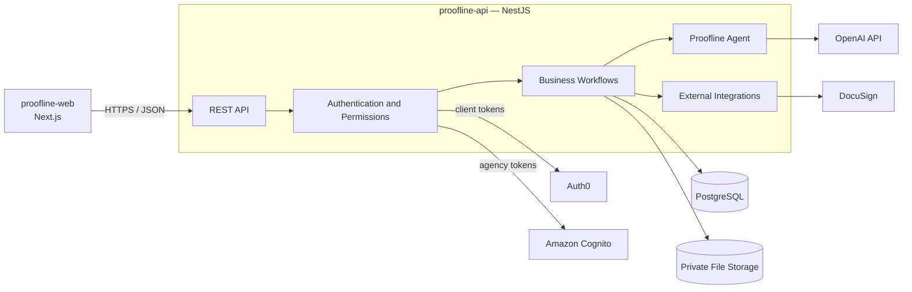

# Proofline

**A human-supervised AI agent for agency operations—from client discovery and proposals to project delivery and reporting.**

Proofline guides agencies through one connected workflow:

`Client Request → AI Discovery → Proposal → Contract → Project Plan → Tasks → Reports`

The Proofline Agent interviews clients, identifies missing requirements, prepares structured documents, and recommends the next workflow action. Every customer-facing document and important action requires approval from an authorized agency member.

# Proofline API

Proofline API is a NestJS backend that manages business workflows, permissions, pricing, data, external integrations, and the controlled tools used by the Proofline Agent.

**Status:** In development

## Product Flow

`Client Request → AI Discovery → Reviewed Proposal → Signed Contract → Project Delivery → Approved Client Reports`

## What This Repository Owns

- REST API and OpenAPI contract
- Business rules and workflow transitions
- Authentication-token validation
- Role and resource permissions
- Server-side pricing calculations
- PostgreSQL schema and migrations
- Proofline Agent orchestration
- DocuSign integration
- Private file operations
- Backend and integration tests

## Main Backend Capabilities

- Client and agency-member identity
- Customer and agency-member management
- Client intake and AI interviews
- Proposal generation, review, and acceptance
- Contract creation and signing status
- Project, milestone, and task management
- Staff task updates
- Customer report generation and approval

## Technology

- NestJS
- Node.js
- TypeScript
- PostgreSQL
- Docker Compose
- Auth0 token verification for clients
- Amazon Cognito token verification for agency members
- OpenAI API for the Proofline Agent
- DocuSign developer sandbox
- OpenAPI

## Architecture

## Local Development

### Requirements

- Node.js
- Package manager
- Docker
- PostgreSQL container
- Required development API credentials

Setup commands will be added when the initial backend scaffold is complete.

## Related Repository

**proofline-web:** Includes the client portal and agency staff application.
